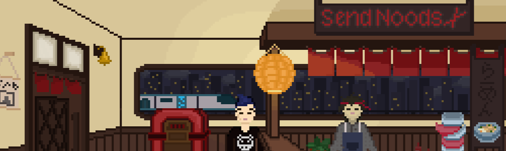

## Hi there! (or should I say, Hiya!) 👋
I'm Nicole Ellis, a third year university student and aspiring Technical Artist passionate about game design and enhancing connectivity between individuals through games. ♥

🛠 **Skills and Tools**
- Programming/Scripting: Python, C#, Git/GitHub
- Game Engines: Unity, Unreal Engine
- 3D Art & Design: Maya, Substance Painter
- Project Management: Notion, Slack, Monday, Miro

🌟 **Featured Projects**
- [**Send Noods**](https://github.com/nicole-ellis/send-noods): A narrative-based game made via Unity featuring custom pixel art, animations, and an original soundtrack.
- Designed and modeled my profile picture in Maya and textured using Substance Painter.

🌱 **I’m Currently Learning**
- Introduction to HTML and Tailwind CSS.

🏆 **Accomplishments**
- Published **[Send Noods](https://nicoleellis.itch.io/send-noods)** on itch.io, showcasing custom art and engaging narratives.
- Presented research poster *"A Narrative-Centered Storyplay for Enhancing Professional Skills"* at the 2024 PML Conference.
- Currently head coach for a professional Valorant esports team under the org **[FURY](https://www.vlr.gg/team/511/fury)**.

📫 **Let's Connect!**
- [Email](nicole.ellis1212@gmail.com )
- [ArtStation](https://www.artstation.com/nicoleellis)
- [LinkedIn](linkedin.com/in/nicolellis)
