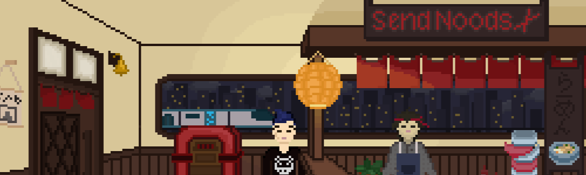

## Hi, I'm Nicole :)
I'm in my final year studying Information Technology at Monash University (m. Games and Immersive Media)  
I'm passionate about game development and enhancing connectivity between individuals through games

🛠 **Skills and Tools**
- Programming/Scripting: C++, C#, Git/GitHub, Python
- Game Engines: Unity, Unreal Engine
- 3D Art & Design: Maya, Substance Painter
- Project Management: Notion, Slack, Monday.com, Miro

🌟 **Featured Projects**
- [**E-Sports Game**](https://github.com/nicole-ellis/sports-game): An aim trainer made using Unreal Engine with unique physics mechanics
- [**Send Noods**](https://github.com/nicole-ellis/send-noods): A narrative-based game about a noodle restaurant made through Unity featuring custom pixel art, animations, and an original soundtrack.
- Designed and modeled my profile picture in Maya and textured using Substance Painter.

🌱 **I’m Currently Working On...**
- Fire to Flourish: A serious game about bushfire resilience
- [**On a Winter's Night, A Gift Giver**](https://omnis-studios.itch.io/on-a-winters-night-a-gift-giver): A game jam submission based in Unity

🏆 **Accomplishments**
- Published **[Send Noods](https://nicoleellis.itch.io/send-noods)** on itch.io, showcasing custom art and engaging narratives.
- Presented research poster *"A Narrative-Centered Storyplay for Enhancing Professional Skills"* at the 2024 PML Conference.
- Professionally coached VALORANT for 4+ years, including rank #1 team in Oceania [**E-KING**](https://www.vlr.gg/team/18111/e-king), alongside [**FURY**](https://www.vlr.gg/team/511/fury) and [**BanditsESC**](https://www.vlr.gg/team/4073/bandit-esc)
